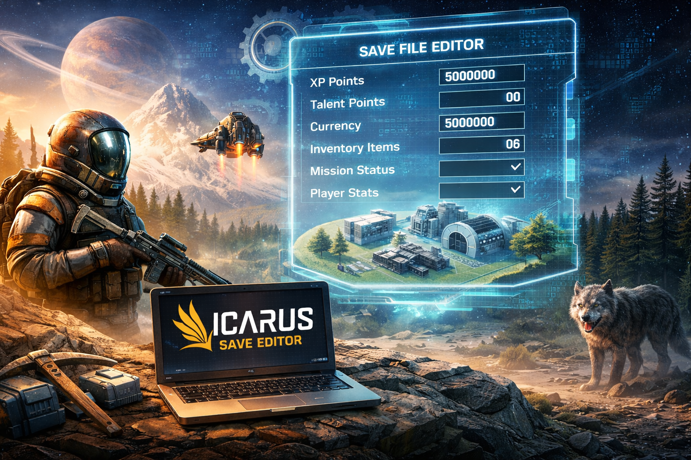

# Icarus Save Editor

[](https://scorecard.dev/viewer/?uri=github.com/naurium/icarus-mount-editor)

A desktop GUI and CLI toolkit for editing [Icarus](https://store.steampowered.com/app/1149460/Icarus/) save files.



**Features:**
- Edit character XP, resources, and account data
- Unlock tech tree blueprints and character talents
- Manage workshop unlocks
- Edit MetaInventory items
- Transform, clone, level, and skin mounts
- Browse and edit in-session player inventories (savegame.json)
- Toggle campaign mission and prospect mission completion

**Why I Made This** My woolly mammoth refused to fight in the desert. Just stood there,
overheated and passive, while enemies swarmed our base. In-game solutions failed, and I
couldn't install mods on my friends' server. So I asked Claude to help me hack the save
files instead. One day later: a working toolkit and a new Ubi mount that fights in the
desert.

> **Note:** Renaming mounts can be done in-game, so this tool focuses on operations the
> game doesn't support natively.

---

## Requirements

- **Windows** (Icarus is a Windows game; Linux users with Proton can use the `--file` flag for the CLI)
- **Python 3.8+**
- [`customtkinter`](https://github.com/TomSchimansky/CustomTkinter) for the GUI (`pip install customtkinter`)

## Installation

```bash
git clone https://github.com/N30Z/icarus-save-editor
cd icarus-save-editor
pip install customtkinter
```

---

## GUI

```bash
python gui_main.py
```

The GUI auto-detects your Steam ID(s) and loads all save files on startup.

### Top Bar

```
[Icarus Save Editor]  [Steam ID ▾]  |  [Prospect save ▾]  [Browse…]  …  [Save + Backup]  [Save All]
```

- **Steam ID** — switch between accounts; all tabs reload automatically.
- **Prospect save** — select a `savegame.json` from your Prospects folder; updates both the
  Prospect Inventory and Campaign tabs simultaneously.
- **Save + Backup** — writes all modified files and creates timestamped backups.
- **Save All** — writes without backup.

### Tabs

| Tab | What it edits |
|-----|---------------|
| **Character** | XP, XP Debt, Dead/Abandoned flag, Credits, Exotics, Refund Tokens, Licences |
| **Tech Tree** | Blueprint / crafting unlocks grouped by tier |
| **Talents** | Character perk bonuses grouped by tree and subtree |
| **Workshop** | Workshop item unlocks (Profile.json Talents) |
| **Inventory** | MetaInventory items (repair, remove) |
| **Mounts** | List, edit, clone, delete mounts (name, level, type, skin) |
| **Prospect Inventory** | Player inventory slots inside the loaded savegame.json |
| **Campaign** | Campaign mission and prospect mission completion toggles |

### Campaign Tab

The Campaign tab is split into two panels:

**Left — Campaign Missions**

Shows the active Great Hunt campaign detected from the loaded prospect save.
Each mission row displays its display name (e.g. `MISSING MINERS`), internal key,
description, type badge (Standard / Choice / Optional / Final), and any
mutually-exclusive conflicts.

Three campaigns are supported:

| Campaign | Map | Boss |
|----------|-----|------|
| Quarrite | Olympus | Rock Golem |
| Gargantuan | Styx | Ape |
| Rimetusk | Prometheus | Ice Mammoth |

**Right — Prospect Missions**

All regular prospect missions grouped by map, each with its display name and
description. 146 missions across four maps:

| Map | Count |
|-----|-------|
| Olympus | 69 |
| Styx | 33 |
| Prometheus | 27 |
| Elysium | 17 |

Both panels share the same **Mark All / Clear All / Apply** controls.
Click **Apply** to write changes to Profile.json, then **Save All** (top bar) to persist to disk.

---

## CLI (Mount Editor)

The legacy CLI focuses on mount operations:

```bash
# List all your mounts
python mount_cli.py list

# Show detailed info for a mount
python mount_cli.py info 0

# Clone a mount
python mount_cli.py clone 0 "Shadow II"

# Set mount to max level
python mount_cli.py level 0 50

# Transform mount type
python mount_cli.py type 0 Tusker

# Change horse color (A1=brown, A2=black, A3=white)
python mount_cli.py variant 0 A3

# See all available commands
python mount_cli.py --help
```

The CLI auto-detects your Steam ID if you only have one Icarus account.

### CLI Commands

#### Information
| Command | Description |
|---------|-------------|
| `list` | List all mounts with type and level |
| `info <mount>` | Show detailed mount properties |
| `types` | List available mount types |
| `validate` | Check mount data integrity |

#### Modification
| Command | Description |
|---------|-------------|
| `rename <mount> <name>` | Rename a mount |
| `level <mount> <level>` | Set mount level (1–50) |
| `type <mount> <type>` | Change mount type |
| `clone <mount> <name>` | Clone a mount |
| `delete <mount>` | Delete a mount |
| `variant <mount> <A1\|A2\|A3>` | Change horse color variant |
| `skin <mount> <index>` | Set cosmetic skin index |
| `reset-talents <mount>` | Reset talents (refund points) |

#### Utility
| Command | Description |
|---------|-------------|
| `backup` | Create a manual backup |
| `restore` | List or restore from backup |
| `config` | Show configuration |

---

## Python API

```python
from mount_editor import MountEditor

editor = MountEditor(steam_id='YOUR_STEAM_ID')
editor.load()

# List all mounts
for mount in editor.list_mounts():
    print(f"[{mount.index}] {mount.name} ({mount.mount_type})")

# Transform to a different type
editor.change_mount_type(0, "Tusker", new_name="Oliphaunt")

# Clone a mount as a different type
editor.clone_mount(0, "Shadowfax Jr", new_type="WoollyMammoth")

# Save changes (creates backup automatically)
editor.save(backup=True)
```

---

## Available Mount Types

### Rideable Mounts

| Type | Key | Description |
|------|-----|-------------|
| Terrenus | `Terrenus` | Wild alien creature. Fast, balanced. Tamed from the wild. |
| Horse | `Horse` | Earth horse from Workshop. 3 color variants (A1/A2/A3). |
| Moa | `Moa` | Fastest mount. Small inventory. |
| Arctic Moa | `ArcticMoa` | Cold-resistant arctic variant of Moa. |
| Buffalo | `Buffalo` | Strong, slow. Large carrying capacity. |
| Tusker | `Tusker` | Slowest but strongest. Found in arctic Styx regions. |
| Zebra | `Zebra` | Fast, similar to Terrenus. |
| Wooly Zebra | `WoolyZebra` | Cold-resistant woolly variant of Zebra. |
| Ubi | `SwampBird` | Swamp-dwelling bird mount. |
| Woolly Mammoth | `WoollyMammoth` | Massive arctic mount with huge carrying capacity. |

### Companion-Only (Cannot be ridden)

| Type | Key | Notes |
|------|-----|-------|
| Blueback Daisy | `BluebackDaisy` | Has skill tree. Summons as follower only. |
| Mini Hippo | `MiniHippo` | No skill tree. Quest reward creature. |

### Workshop Horse Color Variants

Workshop horses come in 3 colors (identical stats, color baked into AI setup):

| Key | Color |
|-----|-------|
| `Workshop_Creature_Horse_A1` | Brown |
| `Workshop_Creature_Horse_A2` | Black |
| `Workshop_Creature_Horse_A3` | White |

Stats: HP 1440, Stamina 373, Speed 805, Sprint 1518, Carry 220 kg.

### Broken / Unreleased

| Blueprint | Status |
|-----------|--------|
| `BP_Mount_Blueback_C` | Spawns with 1 HP |
| `BP_Mount_Raptor_C` | Blueprint doesn't exist yet |
| `BP_Mount_Slinker_C` | Blueprint doesn't exist yet |

---

## File Locations

```
%LocalAppData%\Icarus\Saved\PlayerData\{SteamID}\
├── Mounts.json
├── Profile.json
├── Characters.json
├── MetaInventory.json
└── Prospects\
    └── {ProspectName}.json    ← savegame.json prospect saves
```

On Windows this is `C:\Users\{Username}\AppData\Local\Icarus\Saved\`.

**Finding your Steam ID:** Check folder names inside `PlayerData\`, or visit [steamid.io](https://steamid.io/).

---

## How It Works

### GUI Save Flow

1. `SaveManager` loads Characters.json (double-wrapped), Profile.json, MetaInventory.json.
2. Editor objects wrap the raw JSON and expose typed read/write methods.
3. Prospect saves (savegame.json) are loaded on-demand when selected in the top bar; a shared
   `ProspectManager` notifies both the Prospect Inventory and Campaign tabs via callbacks.
4. **Save All / Save + Backup** writes all modified files; backups use timestamps
   (`.backup_YYYYMMDD_HHMMSS.json`).

### Mount Binary Format

Mount saves embed UE4 serialized properties inside a Base64-encoded blob:

1. `RecorderBlob.BinaryData` decoded from Base64
2. `PropertySerializer.deserialize()` → tree of `FPropertyTag` objects
3. Modifications applied directly to property values
4. `PropertySerializer.serialize()` re-encodes; size headers are written **after**
   serializing to a temp buffer (never calculated upfront)

### Mission Completion

Campaign and prospect mission completion is stored in `Profile.json`:

```json
{
  "Talents": [
    {"RowName": "GH_RG_A", "Rank": 1},
    {"RowName": "STYX_D_Expedition", "Rank": 1}
  ]
}
```

The Campaign tab's Apply button reads/writes these entries via `ProfileEditor`.

---

## Safety

- **Backups**: Every save operation can create a timestamped backup automatically.
- **Validation**: `validate_mount()` checks data integrity before writing.
- **Close the game first**: Always close Icarus before editing saves.

## Troubleshooting

### Mount doesn't appear in-game
- Use only types from the mount table above.
- Check for duplicate `ObjectFName` IDs (`clone_mount` handles this automatically).

### Mount has 0 HP or wrong stats
- Stats come from the mount type, not the save. Changing type gives that type's base stats.

### "Failed to load" errors
- Ensure Icarus is fully closed before editing.
- Restore from a `.backup_*.json` file if needed.

### Mission changes don't take effect
- Click **Apply** in the Campaign tab first, then **Save All** in the top bar.
- Reloading an active prospect mid-session may override changes; make edits when not in a session.

---

## Acknowledgements

- **[CrystalFerrai/UeSaveGame](https://github.com/CrystalFerrai/UeSaveGame)** — The UE4 property
  serialization was based on concepts from this C# library for reading/writing Unreal Engine save files.

## License

MIT License — See [LICENSE](LICENSE)

## Disclaimer

This tool modifies game save files. Use at your own risk. Not affiliated with RocketWerkz or the
Icarus development team.
